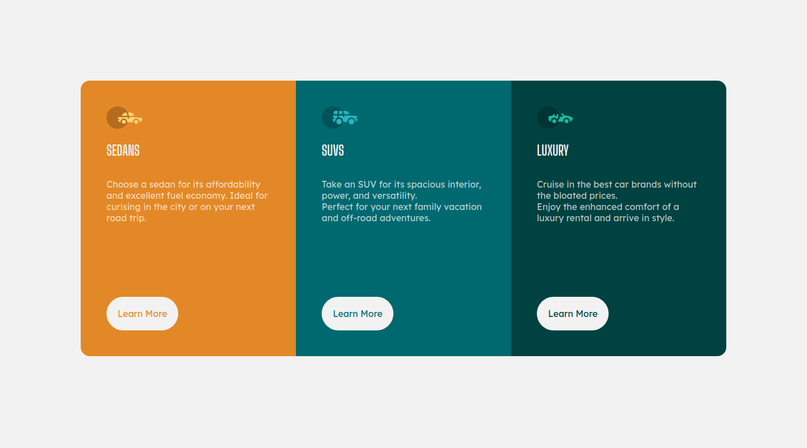

# 3-column preview card component solution

This is a solution to the [3-column preview card component challenge on Frontend Mentor](https://www.frontendmentor.io/challenges/3column-preview-card-component-pH92eAR2-).

## Table of contents

- [Overview](#overview)
  - [The challenge](#the-challenge)
  - [Screenshot](#screenshot)
  - [Links](#links)
- [My process](#my-process)
  - [Built with](#built-with)
  - [What I learned](#what-i-learned)
  - [Useful resources](#useful-resources)
- [Author](#author)
- [Acknowledgments](#acknowledgments)

## Overview

Showcase of three cars.

### The challenge

Users should be able to:

- View the optimal layout depending on their device's screen size
- See hover states for interactive elements

### Screenshot

- Desktop version
  
- Mobile version

  

### Links

- Solution URL: [Solution](https://github.com/gauravnumber/3-column-preview-card-component-main/)
- Live Site URL: [Live site](https://gauravnumber.github.io/3-column-preview-card-component-main/)

## My process

### Built with

- Semantic HTML5 markup
- CSS custom properties
- Flexbox
- Mobile-first workflow

### What I learned

In flex container you can create new flex container inside another flex container.

To see how you can add code snippets, see below:

```html
<main>
  <section class="section-sedans">...</section>
  <section class="section-suvs">...</section>
  <section class="section-luxury">...</section>
</main>
```

```css
main {
  display: flex;
  flex-flow: column nowrap;
}
```

```css
section {
  display: flex;
  flex-flow: column nowrap;
}
```

### Useful resources

- [Flex guide](https://css-tricks.com/snippets/css/a-guide-to-flexbox/) - This site use visual to explain flex.
- [Flex example](https://www.quackit.com/css/flexbox/examples/) - This is an amazing article which helped me finally understand flex. I'd recommend it to anyone still learning this concept.

## Author

- Frontend Mentor - [@gauravnumber](https://www.frontendmentor.io/profile/gauravnumber)
- Twitter - [@gauravnumber](https://www.twitter.com/gauravnumber)

## Acknowledgments

Internet helped me to solved this challenge. If you stuck any problem I suggest you should not panicked because panik is not solution of any problem. It is totally normal not knowing something what you study. It completed normal phenomena.
